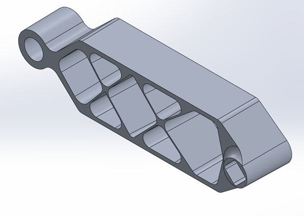

::: {.button}
[← Back to Projects](/projects.html)
:::

# Crank Arm Optimisation Study

## Motivation
This project involved the optimisation of a crank arm to reduce mass while maintaining structural integrity under applied loading. The objective was to use analytical methods and finite element analysis to guide design decisions and produce a practical, manufacturable component.

The work focused on applying structural analysis, optimisation techniques, and engineering judgement to achieve an efficient final design.

## Role
I was responsible for the complete optimisation and analysis process, including:

- Defining objectives, constraints, and assumptions  
- Performing analytical calculations and finite element analysis  
- Conducting topology and parametric optimisation studies  
- Converting optimised results into manufacturable geometry  
- Verifying and validating results through comparison and convergence studies  

## Technical Work

::: {.callout-note collapse="true"}
## Tools used
- SolidWorks  
- Finite Element Analysis (FEA)  
- Topology optimisation  
- Hand calculations  
- Engineering report writing  
:::

- Defined loading, boundary conditions, and material properties  
- Compared analytical calculations against FEA results for validation  
- Performed topology optimisation to identify low-stress regions  
- Converted topology results into a practical, manufacturable geometry  
- Conducted parametric design studies to refine dimensions  
- Performed mesh convergence and buckling analysis  
- Evaluated practicality and manufacturability of the final design  

## Results
The final crank arm design achieved a significant reduction in mass while maintaining acceptable stress levels and structural performance. Verification through analytical comparison, mesh convergence, and buckling analysis confirmed the reliability of the results.

The project demonstrated how simulation-led design can be used effectively when supported by sound assumptions and validation.

## What I Learned
- Applied topology and parametric optimisation in a structural design context  
- Strengthened understanding of FEA setup, validation, and limitations  
- Learned the importance of mesh convergence and buckling analysis  
- Developed experience converting optimised concepts into manufacturable designs  
- Improved technical reporting and engineering decision-making skills  

## Future Improvements
- Perform fatigue analysis under cyclic loading  
- Investigate alternative materials and cost-performance trade-offs  
- Automate optimisation using fully parametric or script-based workflows

::: {.button}
[← Back to Projects](/projects.html)
:::