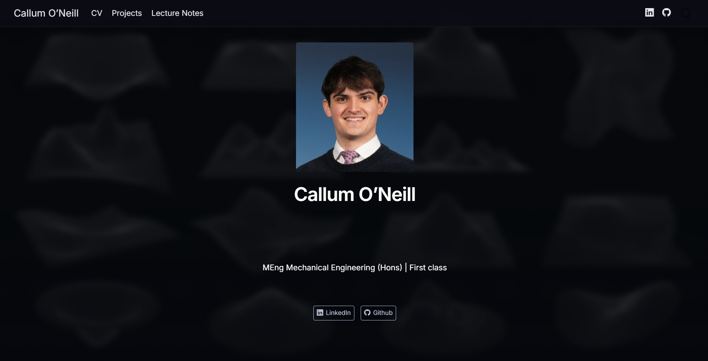

::: {.button}
[← Back to Projects](/projects.html)
:::

# Personal Portfolio Website – Developed with Quarto

## Motivation
I designed and built a responsive portfolio website to showcase my CV, projects, and lecture notes using **Quarto**. The aim was to create a professional and easy-to-navigate platform capable of displaying mathematical content and interactive plots.

This website demonstrates interactive visualisation, LaTeX integration, and modern web styling, deployed using GitHub Pages.

## Role
I was responsible for the full implementation, including:

- Quarto coding  
- Custom CSS styling  
- Embedding LaTeX for mathematical content  
- Integrating interactive Plotly plots  
- Deploying the site on GitHub Pages  

## Technical Work

::: {.callout-note collapse="true"}
## Tools used
- Quarto  
- CSS  
- GitHub Pages  
- LaTeX  
- Plotly  
:::

- Developed page structure and layout using Quarto  
- Applied custom CSS for a clean, professional design  
- Embedded LaTeX to render mathematical formulas  
- Integrated interactive Plotly plots for data visualisation  
- Managed deployment and version control with GitHub Pages  

## Results
The website is fully functional and visually consistent, with a modern and sleek look to stand out from websit. Visitors can easily browse my CV, projects, and lecture notes in a clear and structured format.

## What I Learned
- Improved technical content presentation and web styling skills  
- Gained practical experience with Quarto and LaTeX integration  
- Learned to embed interactive data visualisations using Plotly  
- Developed experience deploying and maintaining a self-hosted website  

## Future Improvements
- Add additional interactive elements  
- Improve accessibility and responsiveness  
- Automate content updates from source files

::: {.button}
[← Back to Projects](/projects.html)
:::