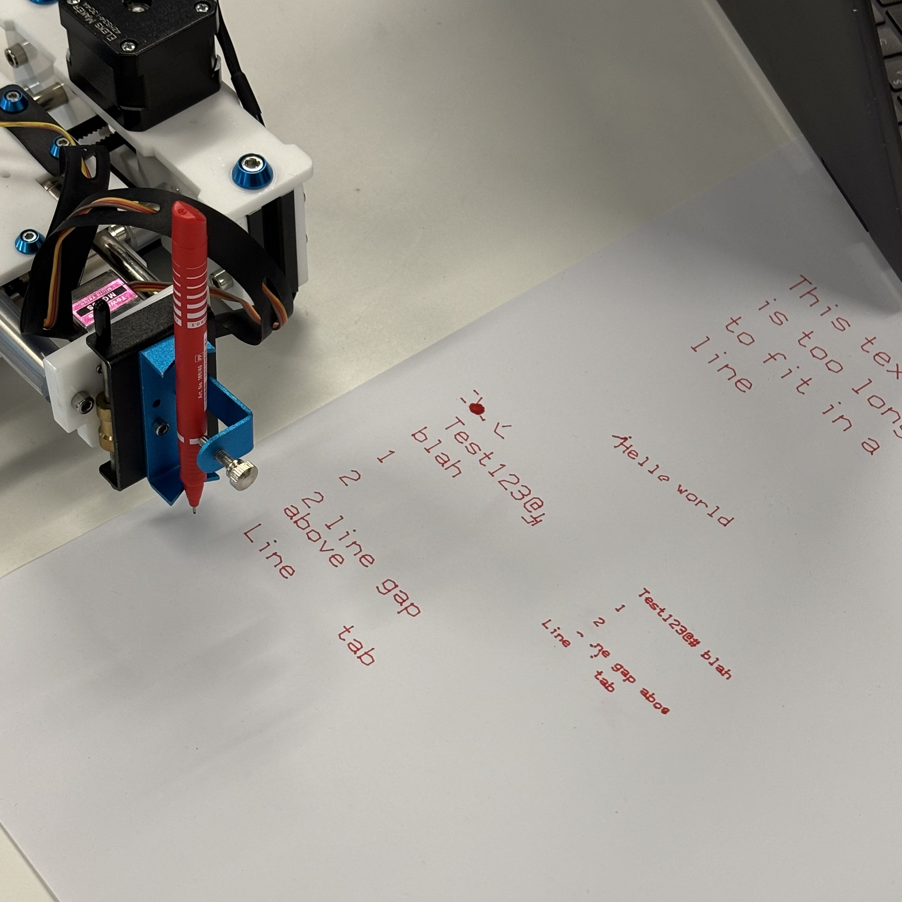

::: {.project-nav}
[← Back to Projects](projects.html)
:::

# RobotWriter – XY Plotter Control Software

## Motivation
The RobotWriter project was a university assignment to control an XY plotter using a provided RS232 interface and serial input file. The objective was to write software that reliably interprets the input and drives the plotter to produce accurate output.

## Role
I was responsible for **writing and testing all the C code** used to control the plotter, including:

- Calling the provided RS232 and serial functions to drive the plotter  
- Parsing input instructions and manually generating G-code to control motion  
- Implementing error checking to ensure reliable operation  
- Testing and debugging the software to achieve accurate, repeatable results  

The full code can be viewed on my [GitHub repository](https://github.com/Eillcon/Robot-Writer).

## Technical Work

::: {.callout-note collapse="true"}
## Tools used
- C  
- G-code generator  
- GitHub  
:::

- Developed the main C program to control the XY plotter  
- Learned and implemented **G-code manually** to generate motion commands  
- Added validation and error handling to prevent motion errors  
- Conducted iterative testing to ensure consistent performance  

## Results
The software successfully drives the XY plotter according to the input files, producing accurate and reliable output. Manual G-code generation allowed precise control over plotting sequences.

## What I Learned
- Strengthened skills in **C programming** for hardware control  
- Learned **G-code generation** and applied it to software-driven motion  
- Gained experience in **software testing, debugging, and error handling** for embedded systems  

## Future Improvements
- Add diagnostic logging for easier troubleshooting  
- Extend functionality to support more complex plotting tasks

::: {.project-nav}
[← Back to Projects](projects.html)
:::